# Sumário
- [Modelagem de um sistema para gestão de dados de uma universidade](#modelagem-de-um-sistema-para-gest%C3%A3o-de-dados-de-uma-universidade)
  
# Modelagem de um sistema para gestão de dados de uma universidade

A presente documentação aborda desde a modelagem até a prototipação de interfaces de um sistema básico de cadastros no contexto de universidade qualquer. A proposta é que sistema contemple cadastro de informaõçes básicas, sendo esses: cadastro de pessoas físicas e juríficas, professores, fornecedores e alunos.

## Casos de uso

Os casos estão divididos em precondição e pós condição. A o primeiro caso aborda o primeiro uso de um sistema de cadastros, enquanto que o segundo, trata do sistema de cadastro após o primeiro uso.

### Precondição

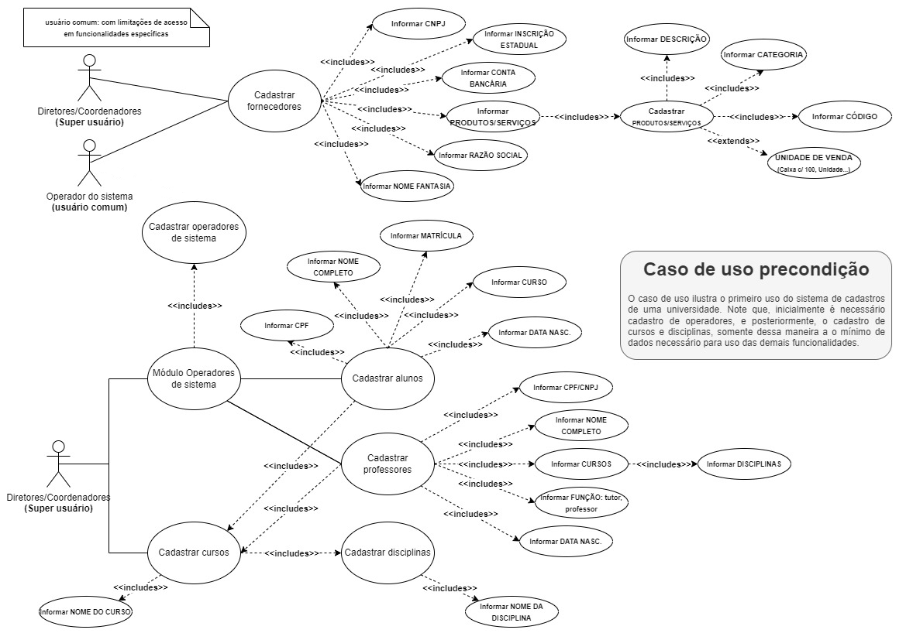

### Pós condição

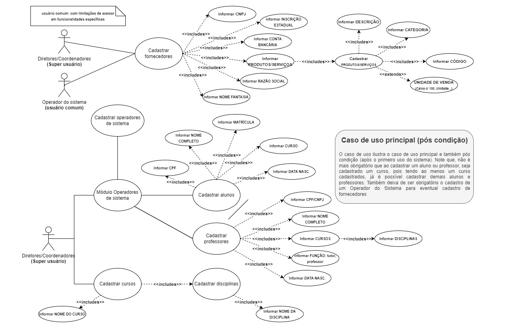

## UML: Diagrama de classes

Num futuro desenvolvimento (codificação) do sistema em questão, abaixo se encontra o que seria o diagrama de classes da solução.

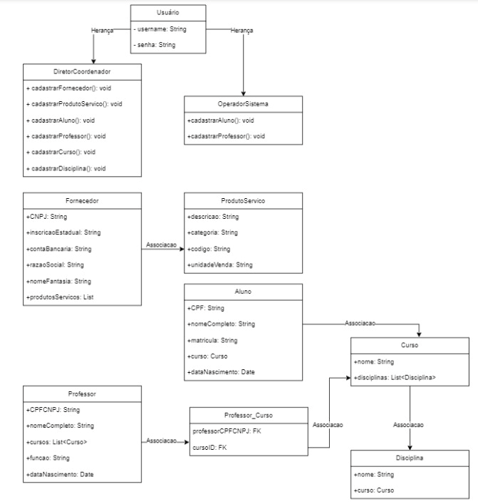

## Interfaces de usuário (IU)

Baseada em toda documentação anterior, foram criados esboços (protótipos) das interfaces de usuário.

### Interface: tela inicial

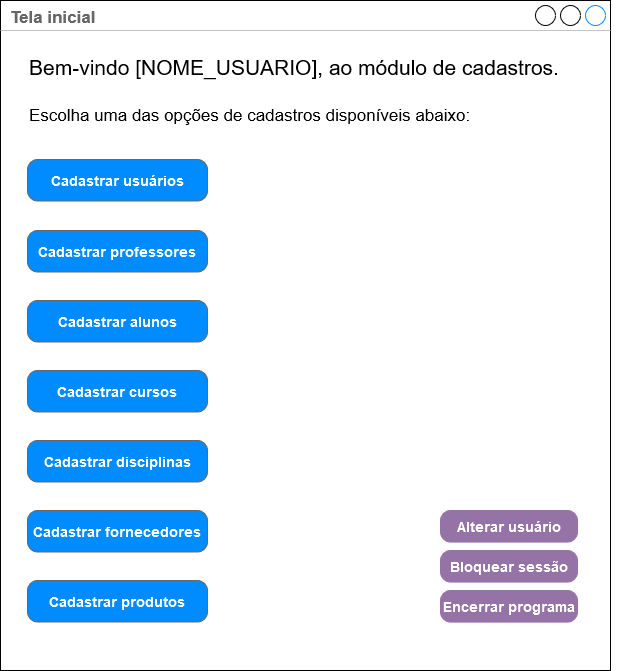

### Interface: cadastro de fornecedores

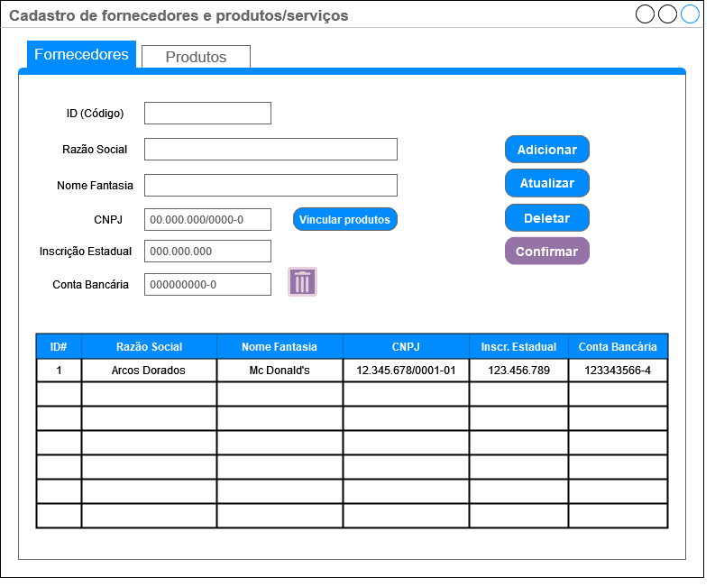

#### Interface: vinculo (associação) de produtos ao fornecedor

Essa interface seria acionada por meio do botão "Vincular produtos" disponível na interface para **cadastro de fornecedores**.

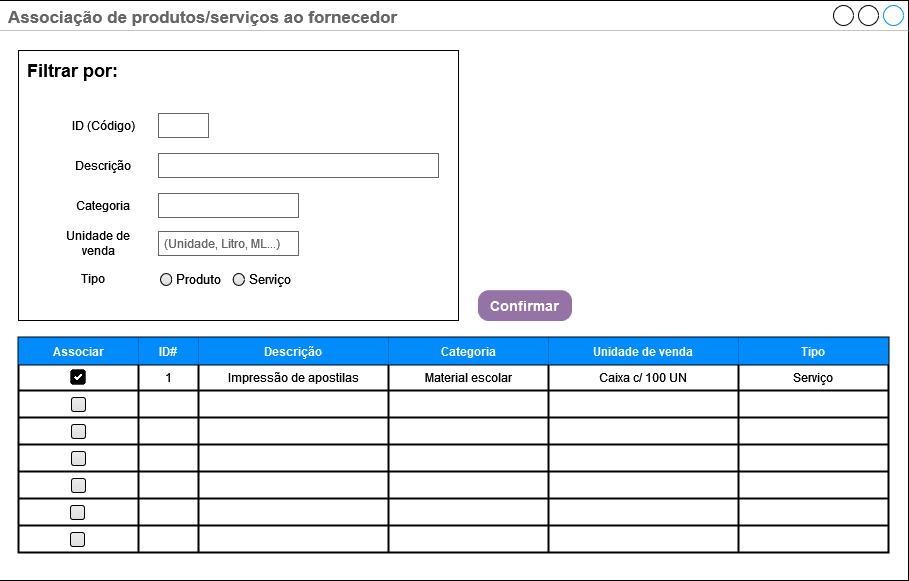

### Interface: cadastro de produtos

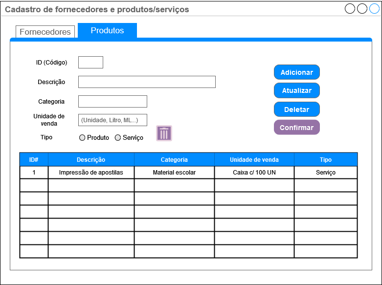

### Interface: cadastro de alunos

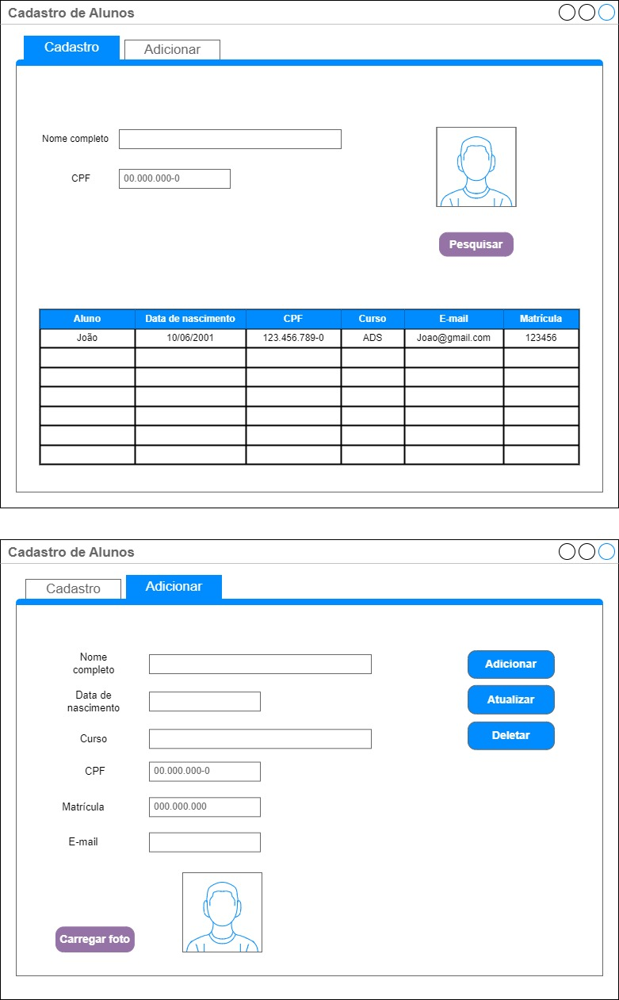

### Interface: cadastro de curso

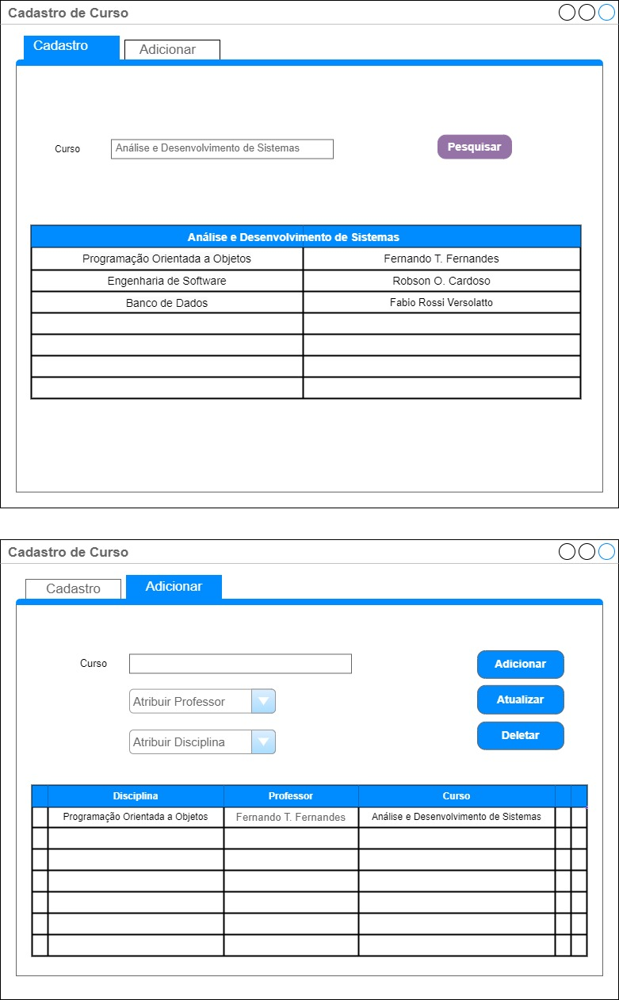

### Interface: cadastro de disciplinas

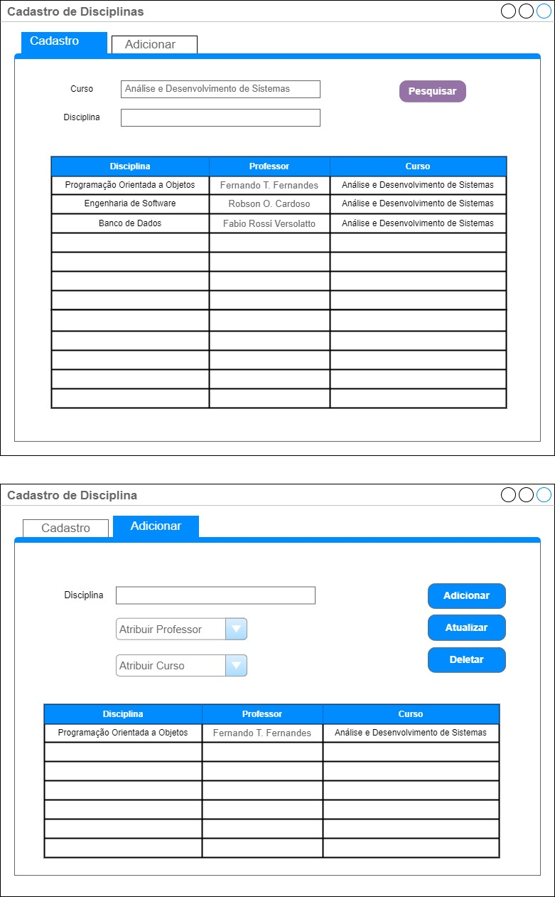

### Interface: cadastro de professores

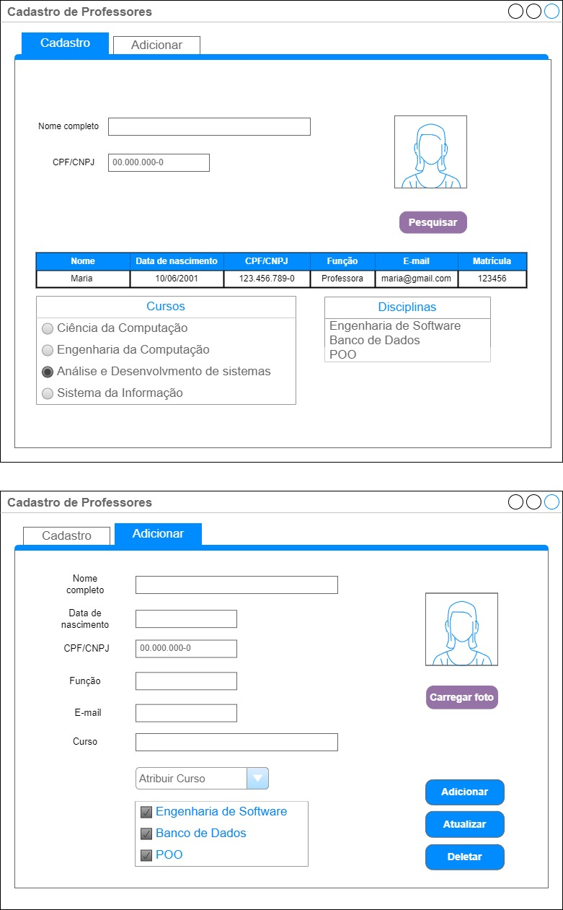

### Interface: cadastro de usuários

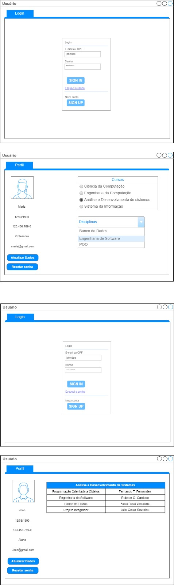

